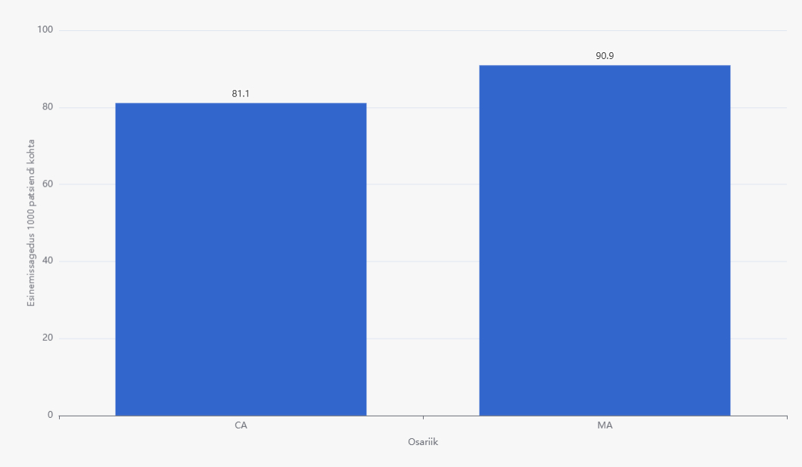
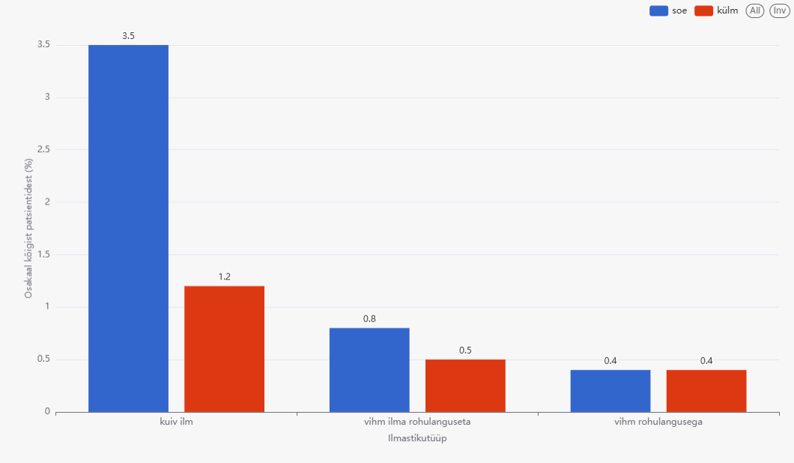
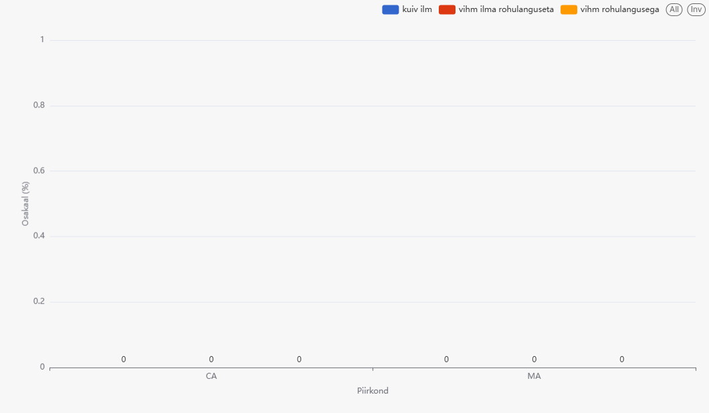

# Mõõdikud - Tulemused

## 1. Valuga seotud haiguste esinemissagedus 1000 patsiendi kohta

## 2. Valuga seotud haigustega patsientide osakaal ilmastikutüübi järgi (%)

## 3. Korduvate valuga seotud diagnooside osakaal (%) kombinatsioonis ilmastikutüübi ja rõhulangusega piirkonna lõikes

