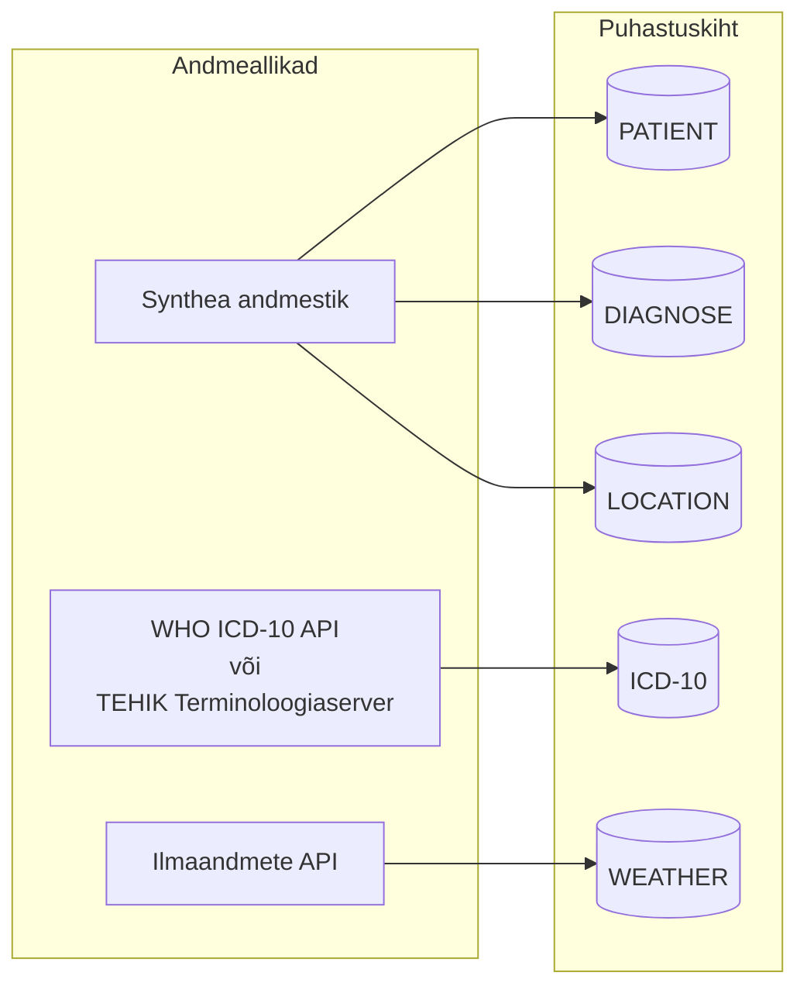
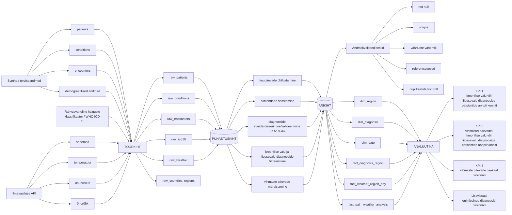
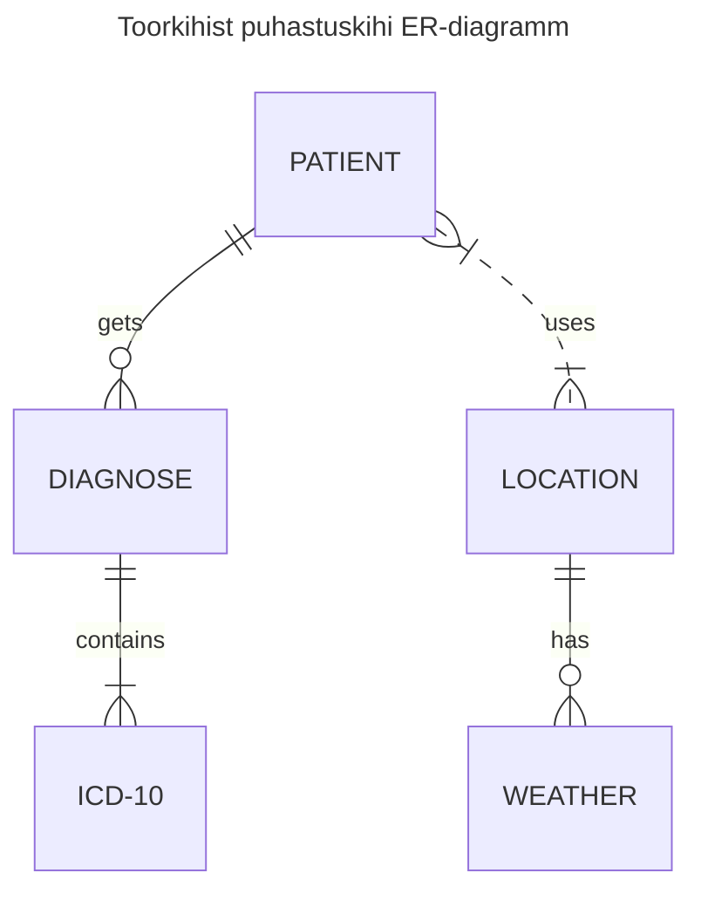

# Arhitektuuri dokumentatsioon
1.[Andmeallikad](#andmeallikad)
2.[Andmevoo skeem](#andmevoo-skeem)
3.[ER-diagramm](#täheskeemi-realisatsioon-er-diagrammina)

Skeemid on loodud Mermaidi süntaksis. Et näha neid graafilisel kujul otse VS Code'is, on soovitatav kasutada Mermaid Editor või Markdown Preview Mermaid Support laiendust.

## Andmeallikad

## Andmevoo skeem
Andmevoo skeemis eristatakse andmetoru jaoks kolme kihti: toorkiht, puhastuskiht ning ärikiht

## Täheskeemi realisatsioon ER-diagrammina

