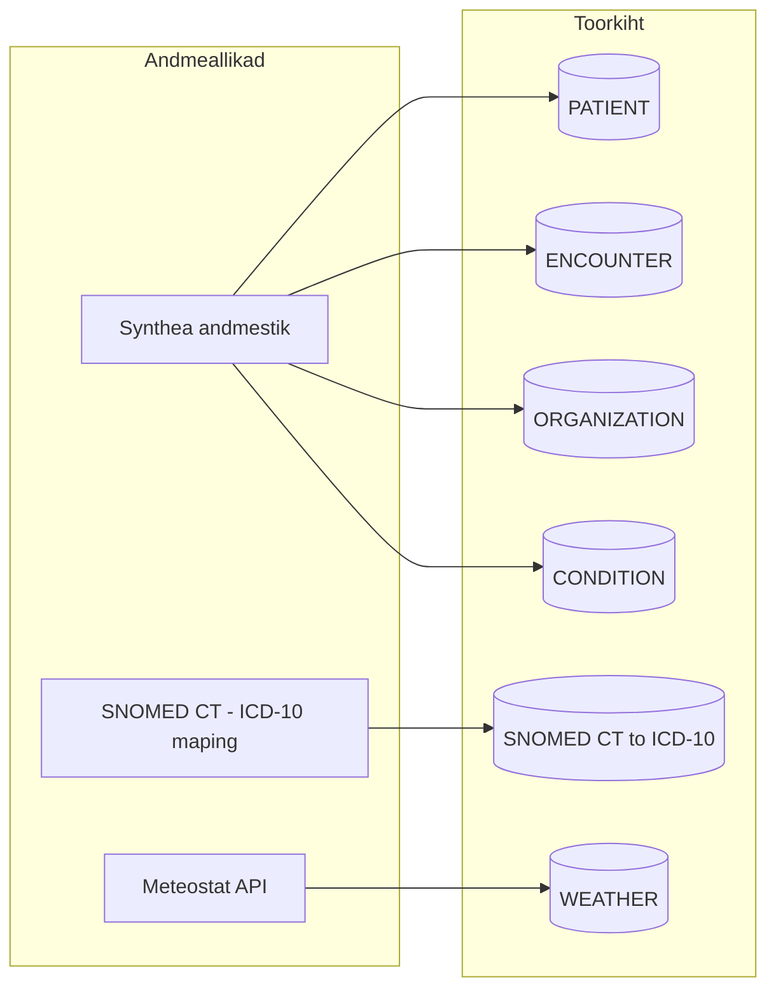
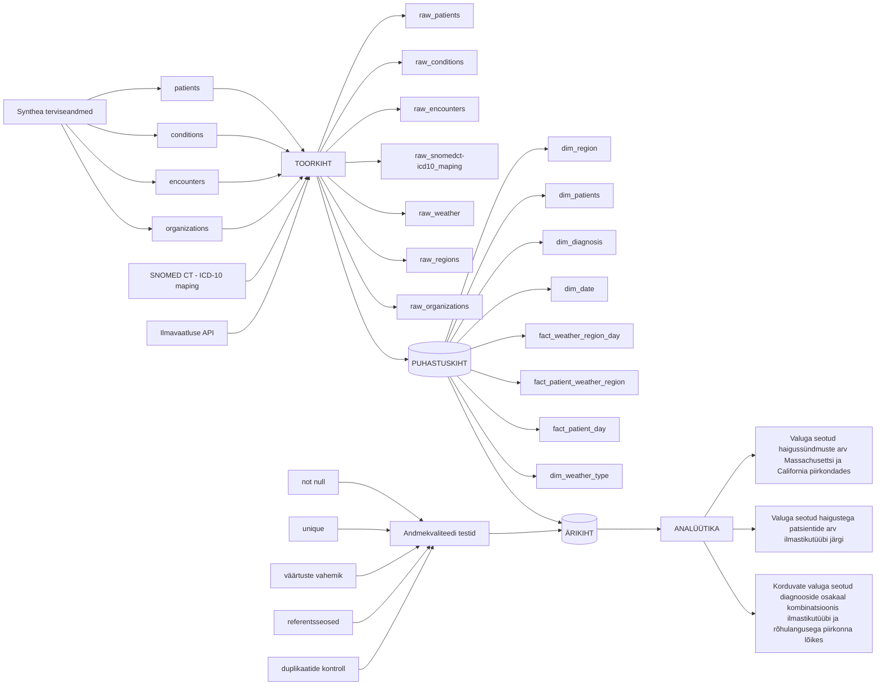
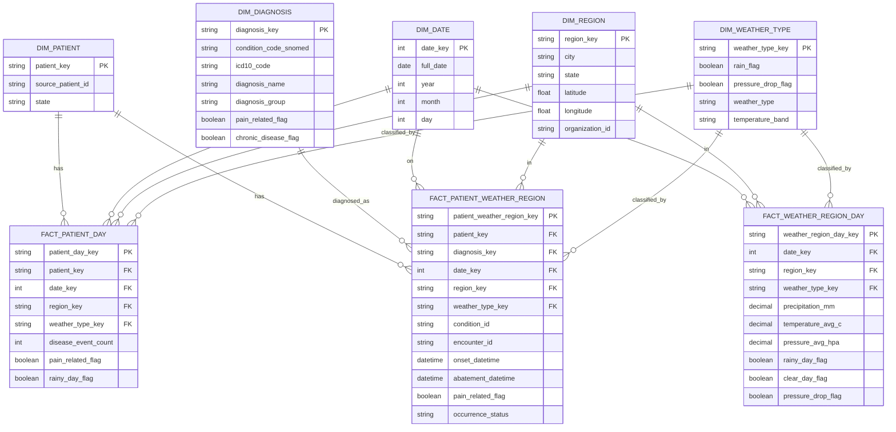

# Arhitektuuri dokumentatsioon
- [Andmeallikad](#andmeallikad)
- [Andmevoo skeem](#andmevoo-skeem)
- [Andmebaasi skeemid](#andmebaasi-skeemid)
- [Faktitabelite kirjeldus](#faktitabelite-kirjeldus)
- [ER-diagramm](#täheskeemi-realisatsioon-er-diagrammina)

Skeemid on loodud Mermaidi süntaksis. Et näha neid graafilisel kujul otse VS Code'is, on soovitatav kasutada Mermaid Editor või Markdown Preview Mermaid Support laiendust.

## Andmeallikad

```mermaid
%% Andmeallikad

graph LR
    subgraph Andmeallikad
        A[Synthea andmestik] 
        B[SNOMED CT - ICD-10 maping]
        C[Meteostat API]
    end

    subgraph Toorkiht
        D[(PATIENT)]
        E[(ENCOUNTER)]
        F[(ORGANIZATION)]
        G[(SNOMED CT to ICD-10)]
        H[(WEATHER)]
        I[(CONDITION)]
    end

    A --> D
    A --> E
    A --> F
    A --> I
    
    B --> G

    C --> H
```

## Andmevoo skeem
Andmevoo skeemis eristatakse andmetoru jaoks kolme kihti: toorkiht, puhastuskiht ning ärikiht
Andmetorus on kasutusel kolm andmeallikat, nagu näha ka ülaltoodud diagrammil: 
1. Sünteetilised terviseandmed (Synthea HL7 FHIR JSON) - Synthea genereerib ühe JSON-faili patsiendi kohta FHIR R4 formaadis. Skript fetch_synthea.py loeb need failid kettalt, parsib ressursitüübid (Patient, Encounter, Organization, Condition) ja laadib need PostgreSQL raw-skeemi. Töödeldakse 100 faili kaupa (batch). Ainult eelnevalt määratud SNOMED koodidega seisundid ja visiidid imporditakse.
2. Ilmastikuandmed (Meteostat API) Skript fetch_weather.py pärib iga haiguse tekkimise asukoha GPS-koordinaadid raw.organizations tabelist ning laadib vastava ajaperioodi ilmastikuandmed Meteostat teegi kaudu. Kasutatakse päevataseme (daily) mõõtmisi. Kui lähimas jaamas andmed puuduvad, suurendatakse otsinguraadiust (35 → 75 → 150 km).
3. ICD-10 / SNOMED koodide kaardistus (CSV) Staatiline icd_snomed.csv fail laetakse fetch_icd_codes.py skriptiga tabelisse raw.icd10_codes. See on viitetabel, mis ei muutu.

Kõik kolm sissevõtuskripti on **idempotentsed** — uuesti käivitamine ei tekita duplikaate. Andmete sissevõttu orkestreerib Airflow DAG (etl_pipeline.py). Synthea FHIR JSON-failid ja ICD-10 koodid laetakse paralleelselt, seejärel päritakse Meteostat API kaudu ilmaandmed kõigi asukohafailide koordinaatidele. DAG käivitub käsitsi (manuaalne trigger).
Airflow DAG laadib kõigepealt andmed toorskeemi (raw), selleks on loodud kolm paralleelset sissevõtuskripti. Seejärel käivitab dbt puhastuskihi (staging) mudelid, mis loevad toorandmete tabelitest ja loovad puhastatud vaated puhastuskihis (staging-skeemis) mudelina. Puhastukihi mudelid on dbt vaated (mitte tabelid) — andmeid ei kopeerita, SQL käivitatakse päringu ajal. Kõigil mudelitel on andmekvaliteedi testid (unikaalsus, not null, FK suhted).

Olulisemad arvutused:

- Surrogaatvõtmed: kõik dimensioonid ja faktid kasutavad MD5-räsi loomulikest võtmetest
- Ilmastiku geograafiline sidumine: ilmaandmed seotakse patsientidega läbi raw.organizations koordinaatide (lat/lon)
- Rõhulanguse lipp: arvutatakse staging-kihis — kui rõhk langes eelmisest päevast ≥5 hPa, on pres_drop = TRUE

```mermaid
%% Andmevoo vooskeem

flowchart LR

    %% =========================
    %% ALGALLIKAD
    %% =========================
    A[Synthea terviseandmed]
    A1[patients]
    A2[conditions]
    A3[encounters]
    A4[organizations]

    B1[SNOMED CT - ICD-10 maping]

    C[Ilmavaatluse API]
   
    A --> A1
    A --> A2
    A --> A3
    A --> A4


    %% =========================
    %% TOORKIHT / PRONKS KIHT
    %% =========================
    D[TOORKIHT]

    A1 --> D
    A2 --> D
    A3 --> D
    A4 --> D
    B1 --> D
    C --> D

    D1[raw_patients]
    D2[raw_conditions]
    D3[raw_encounters]
    D4[raw_snomedct-icd10_maping]
    D5[raw_weather]
    D6[raw_regions]
    D7[raw_organizations]

    D --> D1
    D --> D2
    D --> D3
    D --> D4
    D --> D5
    D --> D6
    D --> D7

    %% =========================
    %% PUHASTUSKIHT / HÕBE KIHT
    %% =========================
    E[(PUHASTUSKIHT)]
    E1[dim_region]
    E2[dim_patients]
    E3[dim_diagnosis]
    E4[dim_date]
    %% faktitabel moodustub lausendist: ühel päeval esinenud ilm ühe piirkonna kohta
    E5[fact_weather_region_day] 
    %% faktitabel moodustub lausendist ühe patsiendi sümptomite algus ja lõpp ühe piirkonna kohta
    E6[fact_patient_weather_region]
    %% faktitabel moodustub lausendist ühe patsiendi sündmus ühes päevas
    E7[fact_patient_day]
    E8[dim_weather_type]

    D --> E
     
    E --> E1
    E --> E2
    E --> E3
    E --> E4 
    E --> E5
    E --> E6
    E --> E7
    E --> E8
       
    E--> F

    %% =========================
    %% ÄRIKIHT / KULD KIHT
    %% =========================
    F[(ÄRIKIHT)]

    F --> H

    %% =========================
    %% ANDMEKVALITEET
    %% =========================
    G[Andmekvaliteedi testid]
    G1[not null]
    G2[unique]
    G3[väärtuste vahemik]
    G4[referentsseosed]
    G5[duplikaatide kontroll]

    G --> F 
    G1 --> G
    G2 --> G
    G3 --> G
    G4 --> G
    G5 --> G

    %% =========================
    %% ANALÜÜTIKA / VISUAALID
    %% =========================
    H[ANALÜÜTIKA]
    H1[Valuga seotud haigussündmuste arv Massachusettsi ja California piirkondades]
    H2[Valuga seotud haigustega patsientide arv ilmastikutüübi järgi]
    H3[Korduvate valuga seotud diagnooside osakaal kombinatsioonis ilmastikutüübi ja rõhulangusega piirkonna lõikes]

    H --> H1
    H --> H2
    H --> H3
```

## Andmebaasi skeemid

| Skeem | Tüüp | Kirjeldus |
|---|---|---|
| `toorkiht` | tabelid | Laaditud andmed muutmata kujul |
| `puhastuskiht` | vaated (views) | Puhastatud ja ümber nimetatud veerud |
| `ärikiht` | vaated (views) | Tabelite ühendamine äriloogika jaoks |
| `analüütika` | tabelid | Lõplik star schema — Superset loeb siit |

## Faktitabelite kirjeldus

### fact_weather_region_day
- **Granulaarsus:** üks päev ühes piirkonnas
- **Peamised elemendid:** sademete hulk, temperatuur, õhurõhk, rõhulanguse lipp

### fact_patient_day
- **Granulaarsus:** üks patsient ühel päeval ühes piirkonnas
- **Peamised elemendid:** patsiendi haigussündmuste arv, vihmasajupäeva lipp

### fact_patient_weather_region
- **Granulaarsus:** üks patsiendi haiguse sündmus kindlal kuupäeval kindlas piirkonnas
- **Peamised elemendid:** patsient, patsiendi haigussündmus, haiguse sündmuse algus- ja lõppkuupäev, vihma tunnus ja asukoha tunnus

## Täheskeemi realisatsioon ER-diagrammina

```mermaid
erDiagram
    %% =========================
    %% DIMENSIOONID
    %% =========================
    DIM_PATIENT {
        string patient_key PK
        string source_patient_id
        string state
    }

    DIM_REGION {
        string region_key PK
        string city
        string state
        float latitude
        float longitude
        string organization_id
    }

    DIM_DATE {
        int date_key PK
        date full_date
        int year
        int month
        int day
    }

    DIM_DIAGNOSIS {
        string diagnosis_key PK
        string condition_code_snomed
        string icd10_code
        string diagnosis_name
        string diagnosis_group
        boolean pain_related_flag
        boolean chronic_disease_flag
    }

    DIM_WEATHER_TYPE {
        string weather_type_key PK
        boolean rain_flag
        boolean pressure_drop_flag
        string weather_type
        string temperature_band
    }

    %% =========================
    %% FAKTITABELID
    %% =========================
    FACT_WEATHER_REGION_DAY {
        string weather_region_day_key PK
        int date_key FK
        string region_key FK
        string weather_type_key FK
        decimal precipitation_mm
        decimal temperature_avg_c
        decimal pressure_avg_hpa
        boolean rainy_day_flag
        boolean clear_day_flag
        boolean pressure_drop_flag
    }

    FACT_PATIENT_DAY {
        string patient_day_key PK
        string patient_key FK
        int date_key FK
        string region_key FK
        string weather_type_key FK
        int disease_event_count
        boolean pain_related_flag
        boolean rainy_day_flag
    }

    FACT_PATIENT_WEATHER_REGION {
        string patient_weather_region_key PK
        string patient_key FK
        string diagnosis_key FK
        int date_key FK
        string region_key FK
        string weather_type_key FK
        string condition_id
        string encounter_id
        datetime onset_datetime
        datetime abatement_datetime
        boolean pain_related_flag
        string occurrence_status
    }

    %% =========================
    %% SEOSED
    %% =========================
    DIM_PATIENT ||--o{ FACT_PATIENT_DAY : has
    DIM_DATE ||--o{ FACT_PATIENT_DAY : on
    DIM_REGION ||--o{ FACT_PATIENT_DAY : in
    DIM_WEATHER_TYPE ||--o{ FACT_PATIENT_DAY : classified_by

    DIM_DATE ||--o{ FACT_WEATHER_REGION_DAY : on
    DIM_REGION ||--o{ FACT_WEATHER_REGION_DAY : in
    DIM_WEATHER_TYPE ||--o{ FACT_WEATHER_REGION_DAY : classified_by

    DIM_PATIENT ||--o{ FACT_PATIENT_WEATHER_REGION : has
    DIM_DIAGNOSIS ||--o{ FACT_PATIENT_WEATHER_REGION : diagnosed_as
    DIM_DATE ||--o{ FACT_PATIENT_WEATHER_REGION : on
    DIM_REGION ||--o{ FACT_PATIENT_WEATHER_REGION : in
    DIM_WEATHER_TYPE ||--o{ FACT_PATIENT_WEATHER_REGION : classified_by
```