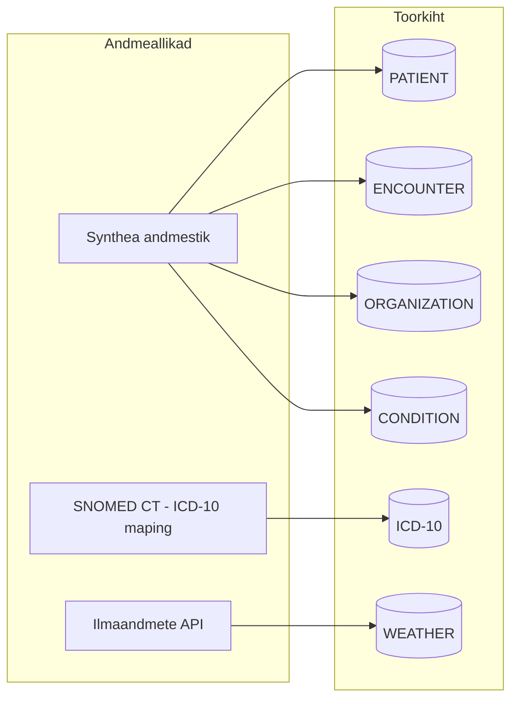
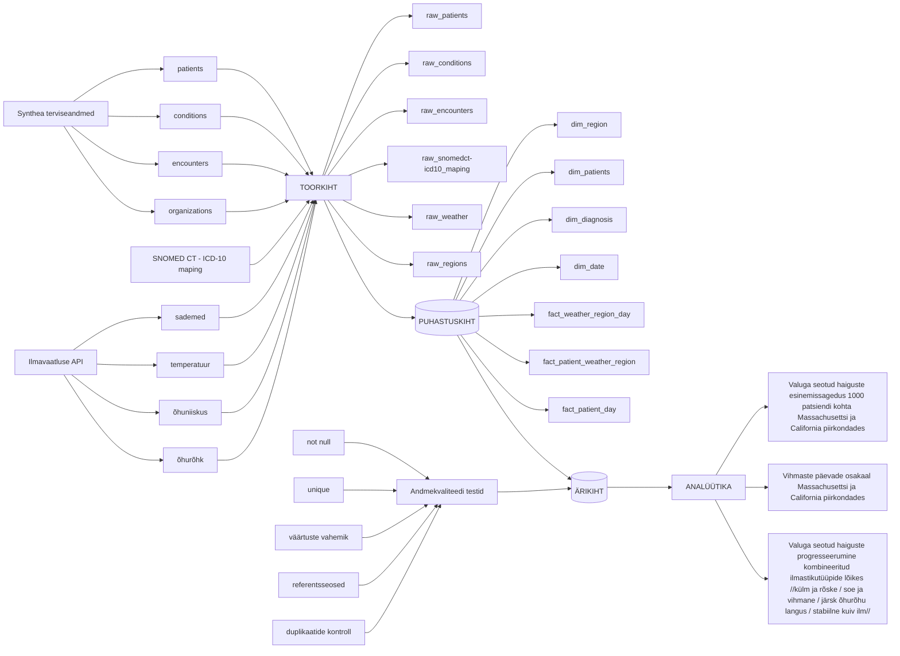
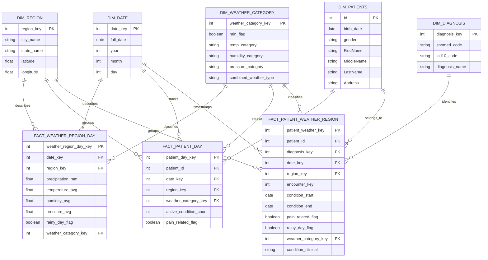

# Arhitektuuri dokumentatsioon
- [Andmeallikad](#andmeallikad)
- [Andmevoo skeem](#andmevoo-skeem)
- [Andmebaasi skeemid](#andmebaasi-skeemid)
- [Faktitabelite kirjeldus](#faktitabelite-kirjeldus)
- [ER-diagramm](#täheskeemi-realisatsioon-er-diagrammina)

Skeemid on loodud Mermaidi süntaksis. Et näha neid graafilisel kujul otse VS Code'is, on soovitatav kasutada Mermaid Editor või Markdown Preview Mermaid Support laiendust.

## Andmeallikad

```mermaid
%% Andmeallikad

graph LR
    subgraph Andmeallikad
        A[Synthea andmestik] 
        B[SNOMED CT - ICD-10 maping]
        C[Ilmaandmete API]
    end

    subgraph Toorkiht
        D[(PATIENT)]
        E[(ENCOUNTER)]
        F[(ORGANIZATION)]
        G[(ICD-10)]
        H[(WEATHER)]
        I[(CONDITION)]
    end

    A --> D
    A --> E
    A --> F
    A --> I
    
    B --> G

    C --> H
```

## Andmevoo skeem
Andmevoo skeemis eristatakse andmetoru jaoks kolme kihti: toorkiht, puhastuskiht ning ärikiht

```mermaid
%% Andmevoo vooskeem

flowchart LR

    %% =========================
    %% ALGALLIKAD
    %% =========================
    A[Synthea terviseandmed]
    A1[patients]
    A2[conditions]
    A3[encounters]
    A4[organizations]

    B1[SNOMED CT - ICD-10 maping]

    C[Ilmavaatluse API]
    C1[sademed]
    C2[temperatuur]
    C3[õhuniiskus]
    C4[õhurõhk]

    A --> A1
    A --> A2
    A --> A3
    A --> A4

    C --> C1
    C --> C2
    C --> C3
    C --> C4

    %% =========================
    %% TOORKIHT / PRONKS KIHT
    %% =========================
    D[TOORKIHT]

    A1 --> D
    A2 --> D
    A3 --> D
    A4 --> D
    B1 --> D
    C1 --> D
    C2 --> D
    C3 --> D
    C4 --> D

    D1[raw_patients]
    D2[raw_conditions]
    D3[raw_encounters]
    D4[raw_snomedct-icd10_maping]
    D5[raw_weather]
    D6[raw_regions]

    D --> D1
    D --> D2
    D --> D3
    D --> D4
    D --> D5
    D --> D6

    %% =========================
    %% PUHASTUSKIHT / HÕBE KIHT
    %% =========================
    E[(PUHASTUSKIHT)]
    E1[dim_region]
    E2[dim_patients]
    E3[dim_diagnosis]
    E4[dim_date]
    %% faktitabel moodustub lausendist: ühel päeval esinenud ilm ühe piirkonna kohta
    E5[fact_weather_region_day] 
    %% faktitabel moodustub lausendist ühe patsiendi sümptomite algus ja lõpp ühe piirkonna kohta
    E6[fact_patient_weather_region]
    %% faktitabel moodustub lausendist ühe patsiendi sündmus ühes päevas
    E7[fact_patient_day]

    D --> E
     
    E --> E1
    E --> E2
    E --> E3
    E --> E4 
    E --> E5
    E --> E6
    E --> E7   
    E--> F

    %% =========================
    %% ÄRIKIHT / KULD KIHT
    %% =========================
    F[(ÄRIKIHT)]

    F --> H

    %% =========================
    %% ANDMEKVALITEET
    %% =========================
    G[Andmekvaliteedi testid]
    G1[not null]
    G2[unique]
    G3[väärtuste vahemik]
    G4[referentsseosed]
    G5[duplikaatide kontroll]

    G --> F 
    G1 --> G
    G2 --> G
    G3 --> G
    G4 --> G
    G5 --> G

    %% =========================
    %% ANALÜÜTIKA / VISUAALID
    %% =========================
    H[ANALÜÜTIKA]
    H1[Valuga seotud haiguste esinemissagedus 1000 patsiendi kohta Massachusettsi ja California piirkondades]
    H2[Vihmaste päevade osakaal Massachusettsi ja California piirkondades]
    H3[Valuga seotud haiguste progresseerumine kombineeritud ilmastikutüüpide lõikes //külm ja rõske / soe ja vihmane / järsk õhurõhu langus / stabiilne kuiv ilm//]

    H --> H1
    H --> H2
    H --> H3
```

## Andmebaasi skeemid

| Skeem | Tüüp | Kirjeldus |
|---|---|---|
| `toorkiht` | tabelid | Laaditud andmed muutmata kujul |
| `puhastuskiht` | vaated (views) | Puhastatud ja ümber nimetatud veerud |
| `ärikiht` | vaated (views) | Tabelite ühendamine äriloogika jaoks |
| `analüütika` | tabelid | Lõplik star schema — Superset loeb siit |

## Faktitabelite kirjeldus

### fact_weather_region_day
- **Granulaarsus:** üks päev ühes piirkonnas
- **Peamised elemendid:** sademete hulk, temperatuur, õhuniiskus, õhurõhk, vihmase/selge päeva tunnus

### fact_patient_day
- **Granulaarsus:** üks patsient ühel päeval ühes piirkonnas
- **Peamised elemendid:** patsiendi haigussündmuste arv, valuga seotud haiguse tunnus, ilma tunnus

### fact_patient_weather_region
- **Granulaarsus:** üks patsiendi haiguse sündmus kindlal kuupäeval kindlas piirkonnas
- **Peamised elemendid:** patsient, patsiendi haigus, valuga seotud haiguse tunnus, haiguse sündmuse algus- ja lõppkuupäev, vihma tunnus ja haiguse kliiniline korduvuse tunnus

## Täheskeemi realisatsioon ER-diagrammina

```mermaid
erDiagram
    %% =========================
    %% DIMENSIOONID
    %% =========================
    DIM_REGION {
        int region_key PK
        string city_name
        string state_name
        float latitude
        float longitude
    }

    DIM_PATIENTS {
        int Id PK
        date birth_date
        string gender
        string FirstName
        string MiddleName
        string LastName
        string Aadress
    }

    DIM_DIAGNOSIS {
        int diagnosis_key PK
        string snomed_code
        string icd10_code
        string diagnosis_name
    }

    DIM_DATE {
        int date_key PK
        date full_date
        int year
        int month
        int day
    }

    DIM_WEATHER_CATEGORY{
        int weather_category_key PK
        boolean rain_flag
        string temp_category
        string humidity_category
        string pressure_category
        string combined_weather_type
    }

    %% =========================
    %% FAKTITABELID
    %% =========================
    FACT_WEATHER_REGION_DAY {
        int weather_region_day_key PK
        int date_key FK
        int region_key FK
        float precipitation_mm
        float temperature_avg
        float humidity_avg
        float pressure_avg
        boolean rainy_day_flag
        int weather_category_key FK
    }

    FACT_PATIENT_DAY {
        int patient_day_key PK
        int patient_Id FK
        int date_key FK
        int region_key FK
        int weather_category_key FK
        int active_condition_count
        boolean pain_related_flag
    
    }

    FACT_PATIENT_WEATHER_REGION {
        int patient_weather_key PK
        int patient_Id FK
        int diagnosis_key FK
        int date_key FK
        int region_key FK
        int encounter_key
        date condition_start
        date condition_end
        boolean pain_related_flag
        boolean rainy_day_flag
        int weather_category_key FK
        string condition_clinical 

    }

    %% =========================
    %% SEOSED
    %% =========================
    DIM_REGION ||--o{ FACT_WEATHER_REGION_DAY : describes
    DIM_DATE ||--o{ FACT_WEATHER_REGION_DAY : describes
    DIM_WEATHER_CATEGORY ||--o{ FACT_WEATHER_REGION_DAY : classifies

    DIM_REGION ||--o{ FACT_PATIENT_DAY : groups
    DIM_DATE ||--o{ FACT_PATIENT_DAY : tracks
    DIM_PATIENTS ||--o{ FACT_PATIENT_DAY : belongs_to
    DIM_WEATHER_CATEGORY ||--o{ FACT_PATIENT_DAY : classifies

    DIM_REGION ||--o{ FACT_PATIENT_WEATHER_REGION : groups
    DIM_DATE ||--o{ FACT_PATIENT_WEATHER_REGION : timestamps
    DIM_PATIENTS ||--o{ FACT_PATIENT_WEATHER_REGION : belongs_to
    DIM_DIAGNOSIS ||--o{ FACT_PATIENT_WEATHER_REGION : identifies
    DIM_WEATHER_CATEGORY ||--o{ FACT_PATIENT_WEATHER_REGION : classifies
```